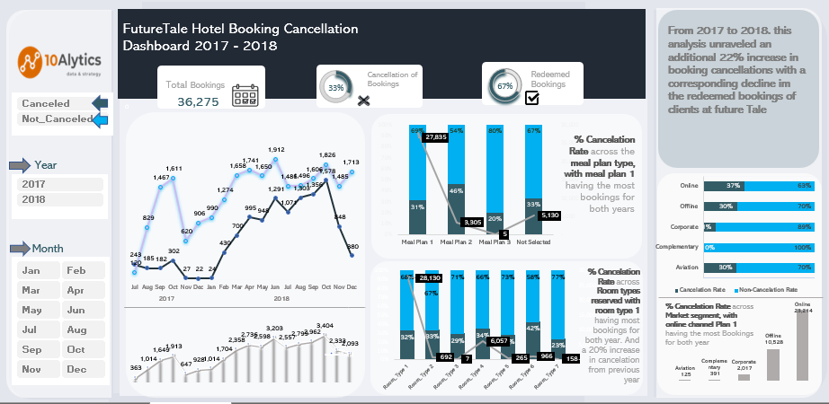

# FutureTale-Hotel-Booking

## Table of Contents
- [Project Overview](#project-overview)
- [Problem Statement](#problem-statement)
- [Project Objective](#project-objective)
- [Data Sources](#data-sources)
- [Data processing](#data-processing)
- [Data Visualization](#Data-Visualization)
- [Evaluation Metrics](#evaluation-metrics)
- [Key Insights](#key-insights)
- [Conclusion](#conclusion)

## Project Overview
The FutureTale Hotel Reservation project using Excel aims to understand, address and mitigate the challenges posed by a significant increase in hotel reservation cancellation. By leveraging my skill in excel, the data unveiled, the hotel experienced a concerning trend - a 22% increase in cancellation rates during the period of July 2017 and October 2018, casting a shadow over its once-stable reservation landscape. Not only this was unraveled but also understand the underlying factors that contributed to this significant shift in reservation dynamics.

## Problem Statement
- High number of cancellations and no-shows as a result of Current cancellation policy that allows free or low-cost cancellations.
- This policy benefits guests but negatively impacts the hotel’s revenue.

## Project Objective
The primary objective of this project is to provide insights, conduct a comprehensive analysis of hotel reservation data with the aim of understanding and addressing specific challenges related to increased cancellation rates

## Data Sources
The dataset used in this project was provided by 10Alytics. The dataset contains Booking Id, no of adults, no of children, no of weekend nights, no of week nights, type of meal plan, required car parking space, room type reserved, lead time, arrival year, arrival month, month, arrival date, date, market segment type, repeated guest, no of previous cancelation, no of previous booking, booking status, avg price per room

## Data processing
In the process of handling the data, I engaged in compilation and cleansing activities. I systematically examined the dataset to identify and eliminate any duplicate entries. Additionally, I enhanced the dataset by introducing a new column labelled "sum of is_cancelled." Through the utilization of the "IF" function, I assigned the value "1" to indicate cancelled bookings and "0" for those that were not cancelled. Furthermore, I employed the VLOOKUP function to extract the corresponding arrival month names. This involved creating a table with an array containing month numbers paired with their respective names. By referencing this table, I successfully obtained the accurate arrival month names for the reservations at the FutureTale Hotel.

## Data Visualization

After I did data cleaning, I utilise Excel's functionalities for exploratory data analysis to uncover patterns, trends, and anomalies in the reservation data. Visualized data distributions and relationships between variables using charts, graphs, and pivot tables. Calculated cancellation rates for different periods, market segments, meal plans, and room types using Excel formulas. I also Conduct detailed analyses of market segments, meal plans, and room types to understand their individual impact on cancellations. Used Excel to perform segmentation analysis and generate insights into the characteristics of high-cancellation segments. Also, Analysedd booking trends over time, especially between July 2017 and October 2018. Then, create time series charts to visualize the progression of bookings, cancellations, and redemption rates. Develop strategic recommendations based on Excel-generated insights to address the identified challenges.

## key Metrics
### Overall Booking and Cancellation Analysis
- The analysis reveals that out of a total of 36,275 bookings, 33% were canceled, indicating a very high proportion of reservations being cancelled. On the other hand, 67% of the bookings were successfully redeemed.
### Cancelation trend for the period in view
- In the year 2017, the hotel recorded a total of 6,514 bookings, demonstrating a cancelation rate of 15% and a redemption rate of 85%. As we move to the year 2018, the total bookings increased to 29,761 but the cancellation rate also saw a rise to 37% resulting in redemption rate of 63%. 
- From 2017 to 2018. this analysis unraveled an additional 22% increase in booking cancellations with a corresponding decline in the redeemed bookings of clients at future Tale
### Meal Plan and Room type Impacts
- % Cancelation Rate across the meal plan type, with meal plan 1 having the most bookings for both years while meal 2 experienced the highest cancelation rate
- % Cancelation Rate across Room types reserved with room type 1 having most bookings for both years. And a 20% increase in cancelation from previous year

## Conclusion
The FutureTale Hotel reservation analysis showcase the synergy between data and strategy, creating a narrative of resilience, adaptability, and success in the ever-evolving world of hospitality
